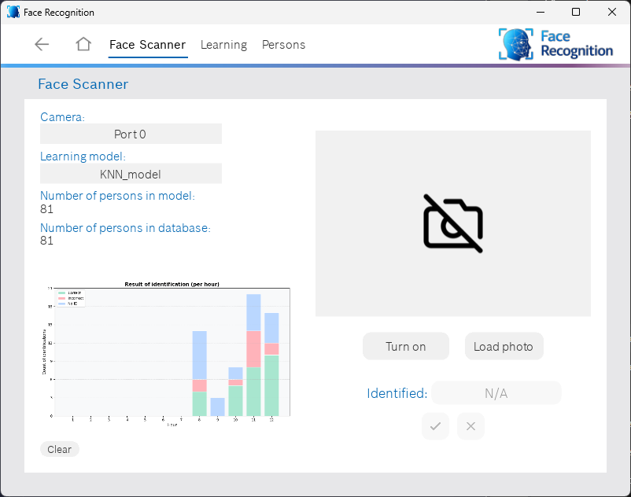
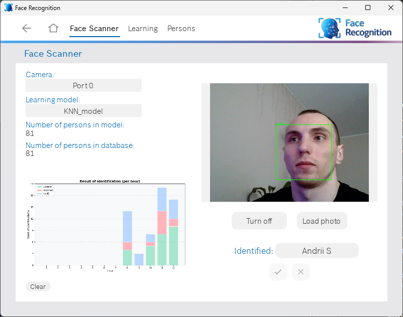
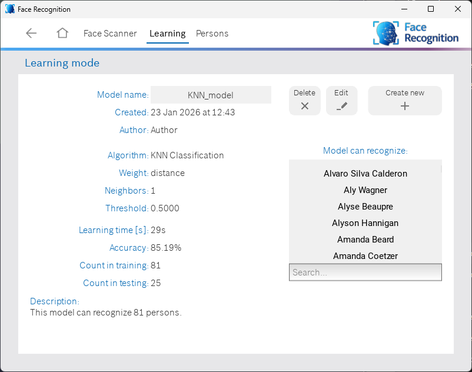
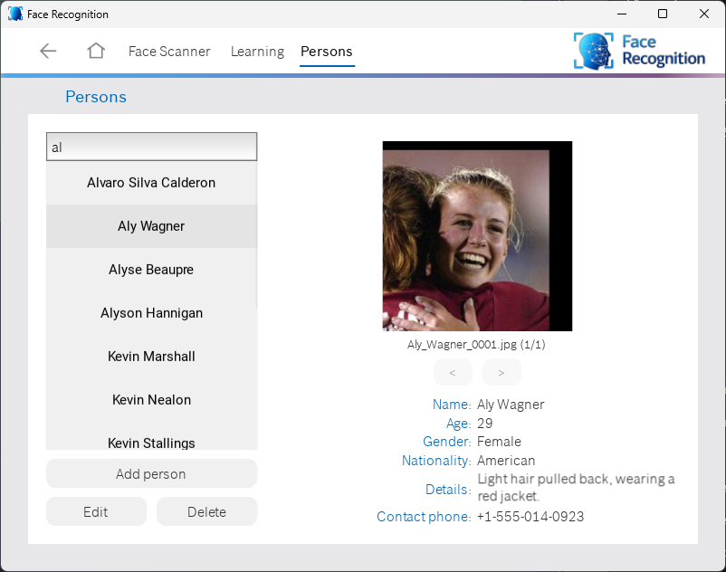
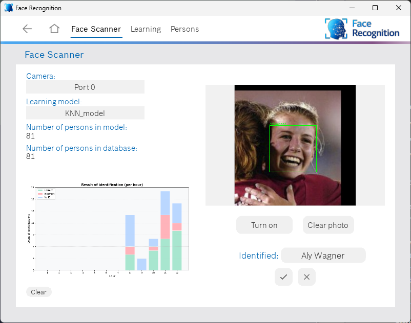
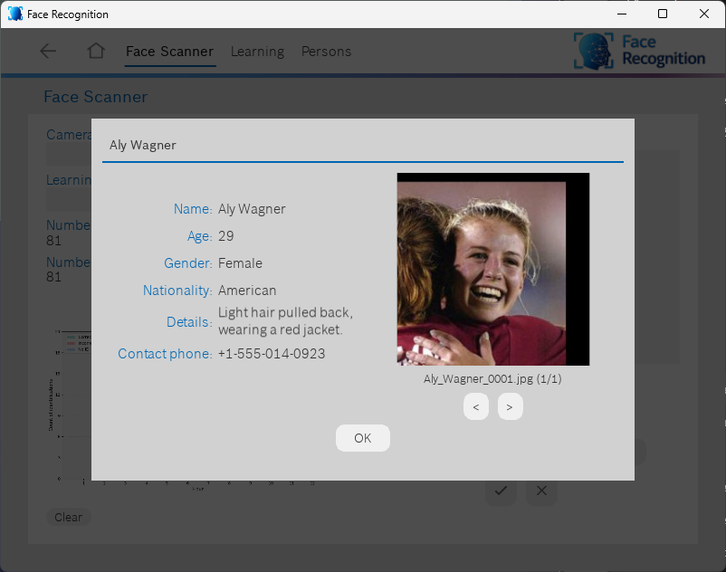
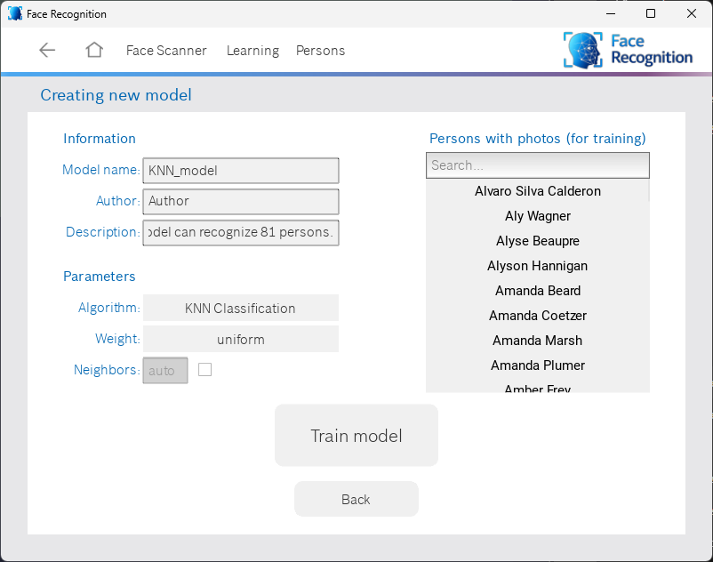
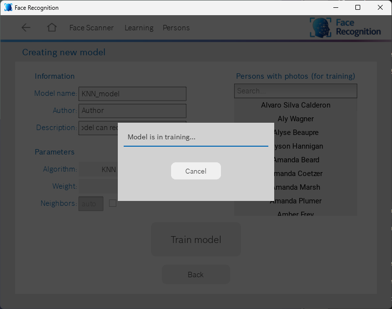
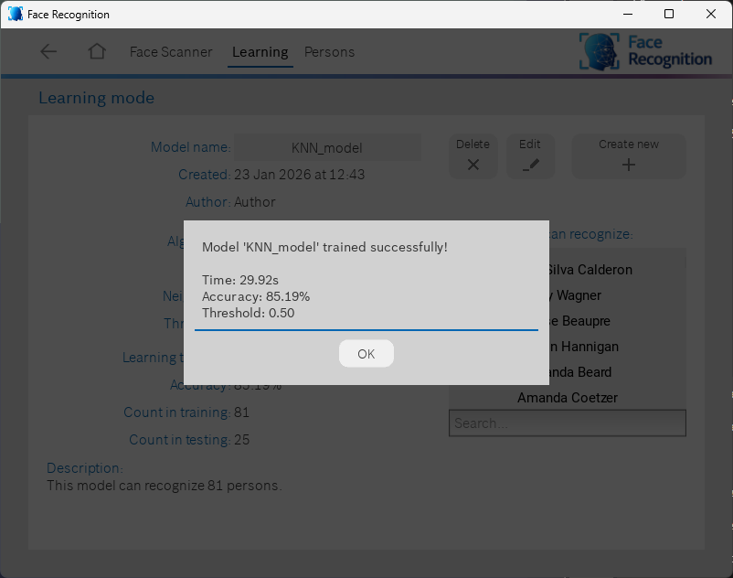
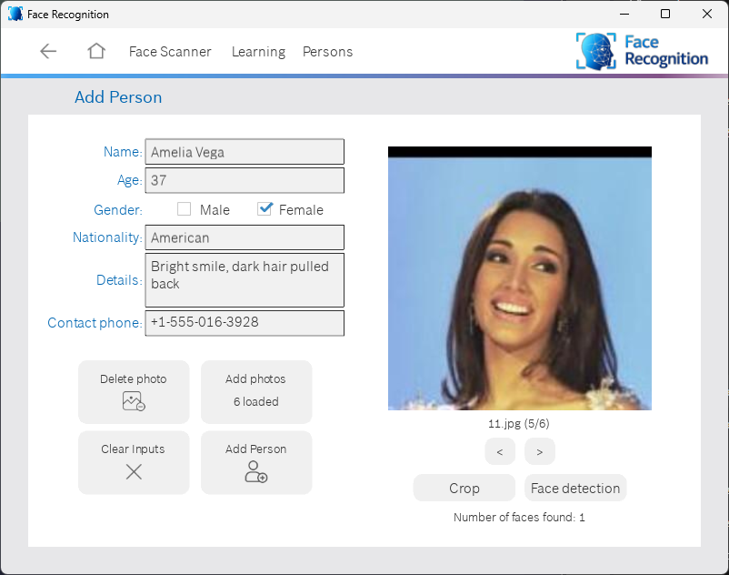

# Face Recognition System

A comprehensive face recognition application built with Python, Kivy, and machine learning. This
system enables real-time face detection and identification using webcam or static images, with
support for multiple classification algorithms and a user-friendly GUI.

<p align="center">
  
</p>
<p align="center"><strong>Main interface of the Face Recognition application</strong></p>

## Features

### Core Functionality

- Real-time Face Recognition: Identify faces through webcam feed with live prediction
- Static Image Analysis: Upload and analyze images for face recognition
- Multiple ML Algorithms: Support for both KNN and SVM classification
- Person Management: Create, edit, and manage person profiles with photos
- Model Training: Train custom recognition models with your own dataset
- Statistics Dashboard: Track identification accuracy and performance metrics

### Advanced Features

- Photo Management: Import, crop, and detect faces in training images
- Model Configuration: Fine-tune algorithm parameters (neighbors, weights, thresholds)
- Training Visualization: Real-time training progress and accuracy metrics
- Face Detection: Built-in face detection for photo preprocessing
- Data Persistence: Automatic saving of models and person data

## Screenshots

### Main Screens

<p align="center">  </p>
<p align="center"><strong>Face Scanner - Real-time face recognition interface</strong></p> 

<p align="center">  </p>
<p align="center"><strong>Learning Mode - Train and manage recognition models</strong></p>

<p align="center">  </p>
<p align="center"><strong>Person Management - View and edit person profiles</strong></p>

### Workflow

<p align="center">  </p>
<p align="center"><strong>Face recognition using a photo</strong></p>

<p align="center">  </p>
<p align="center"><strong>Displaying information about an identified person</strong></p>

<p align="center">  </p>
<p align="center"><strong>Configuring the training of a new face recognition model</strong></p>

<p align="center">  </p>
<p align="center"><strong>Model training in progress</strong></p>

<p align="center">  </p>
<p align="center"><strong>Results of the trained model</strong></p>

<p align="center">  </p>
<p align="center"><strong>Adding a new person to the database</strong></p>

## Technology Stack

- UI Framework: Kivy 2.3.1
- Computer Vision: OpenCV 4.6.0, dlib 19.22.99
- Face Recognition: face-recognition 1.3.0
- Machine Learning: scikit-learn 1.3.2
- Data Visualization: matplotlib 3.7.2
- Data Processing: numpy 1.24.4, imutils 0.5.4
- Data Validation: pydantic 1.10.24

## Installation

### Prerequisites

- Python 3.8 or higher
- Poetry (Python package manager)
- Webcam (for real-time recognition)
- Windows OS (pre-built dlib wheel provided for Windows)

### Install Poetry

If you don't have Poetry installed, install it first:

#### Windows (PowerShell):

```powershell
(Invoke-WebRequest -Uri https://install.python-poetry.org -UseBasicParsing).Content | py -
```

#### macOS/Linux:

```bash
curl -sSL https://install.python-poetry.org | python3 -
```

### Setup Instructions

#### 1. Clone the repository

```bash
git clone https://github.com/AndriiSonsiadlo/face-recognition-classifiers-gui
cd face-recognition-classifiers-gui
```

#### 2. Install dependencies using Poetry

```bash
poetry install
```

This will:

- Create a virtual environment
- Install all required dependencies from `pyproject.toml`

#### 3. Activate the Poetry virtual environment

```bash
poetry env activate
```

#### 4. Run the application

```bash
python src/main.py
```

## Project Structure

```
face-recognition-classifiers-gui/
├── src/
│   ├── algorithms/          # ML algorithms (KNN, SVM)
│   ├── assets/              # UI files and images
│   │   ├── ui/              # Kivy UI definitions
│   │   └── images/          # Icons and graphics
│   ├── core/                # Core configuration and utilities
│   ├── models/              # Data models
│   │   ├── model/           # ML model management
│   │   └── person/          # Person data management
│   ├── services/            # Business logic services
│   ├── ui/                  # User interface components
│   │   ├── screens/         # Application screens
│   │   ├── presenters/      # MVP presenters
│   │   └── popups/          # Dialog windows
│   ├── utils/               # Utility functions
│   └── main.py              # Application entry point
├── model_data/              # Trained models storage
├── person_data/             # Person profiles and photos
├── statistics/              # Usage statistics
├── temp/                    # Temporary files
├── pyproject.toml           # Poetry configuration
└── README.md                # This file
```

## Usage Guide

### 1. Adding Persons

1. Navigate to Persons screen
2. Click Add Person
3. Fill in person details (name, age, gender, etc.)
4. Click Add Photos to import training images
5. Use Crop or Face Detection to prepare images
6. Click Add Person to save

Show Image

### 2. Training a Model

1. Go to Learning mode
2. Click Create New
3. Enter model name and author
4. Select algorithm (KNN or SVM)
5. Configure parameters:
    - KNN: Number of neighbors, weight function
    - SVM: Gamma parameter
6. Click Train Model
7. Wait for training completion

Show Image

### 3. Face Recognition

#### Live Recognition (Webcam):

1. Open Face Scanner screen
2. Select a camera from dropdown
3. Choose a trained model
4. Click Turn On
5. System identifies faces in real-time

#### Image Recognition:

1. Open Face Scanner screen
2. Select a trained model
3. Click Load Photo
4. Select an image file
5. View recognition results

Show Image

### 4. Model Management

1. Edit Model: Adjust threshold, add descriptions
2. Delete Model: Remove unused models
3. View Statistics: Training time, accuracy, dataset size

### 5. Statistics

1. Track identification success/failure rates
2. Hourly breakdown of recognition attempts
3. Clear statistics as needed

Show Image

## Configuration

Key configuration options can be found in `src/core/config.py`:

```python
# Person Configuration
ALLOWED_EXTENSIONS = {"png", "jpg", "jpeg", "bmp", "tiff"}
MIN_PHOTOS_FOR_TRAINING = 1
DEFAULT_COUNT_FRAME = 5  # Frames for stable recognition

# Model Configuration
DEFAULT_THRESHOLD = 0.5
DEFAULT_N_NEIGHBORS = 5
DEFAULT_WEIGHT = "distance"
DEFAULT_GAMMA = "scale"
```

## Algorithm Details

### KNN Classification

#### K-Nearest Neighbors algorithm for face matching:

- How it works: Compares face encoding with K nearest neighbors
- Parameters:
    - `n_neighbors`: Number of neighbors to consider (default: 5, auto-calculated)
    - `weight`: Distance weighting function
        - `distance`: Closer neighbors have more influence
        - `uniform`: All neighbors have equal weight
    - `threshold`: Similarity threshold (0-1, default: 0.5)

- Best for: Small to medium datasets (<100 persons)
- Advantages: Simple, interpretable, adjustable threshold
- Disadvantages: Slower with large datasets

### SVM Classification

#### Support Vector Machine with linear kernel:

- How it works: Finds optimal hyperplane to separate face classes
- Parameters:
    - `gamma`: Kernel coefficient
        - `scale`: `1 / (n_features * X.var())`
        - `auto`: `1 / n_features`
    - No threshold adjustment available
- Best for: Medium to large datasets (>100 persons)
- Advantages: Efficient with large datasets, good generalization
- Disadvantages: Less interpretable, no confidence threshold

### Face Encoding

Both algorithms use 128-dimensional face encodings generated by dlib's face recognition model:

1. Face detection using HOG/CNN
2. Face landmark detection (68 points)
3. Face alignment
4. 128-D embedding extraction

### Architecture

The application follows the MVP (`Model-View-Presenter`) pattern:

- **Models**: Data structures and business logic (`models/`, `services/`)
- **Views**: Kivy screens and UI components (`ui/screens/`, `assets/ui/`)
- **Presenters**: Logic coordinators between models and views (`ui/presenters/`)

## License

This project is licensed under the MIT License - see the [LICENSE](LICENSE) file for details.
